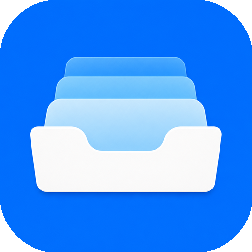

**Languages:** English | [简体中文](README.zh-CN.md)

# NeatWebApp

<p align="center">
  
</p>

**Turn websites into focused macOS apps.** Pin a site as its own window with its own cookies and data, then open it from a launcher at the notch — no tabs, no browser chrome in the way.

**Requires macOS 15 or later, Apple silicon or Intel.** Open source under the MIT License. Your sites and their data stay on your Mac — there is no account and no sync.

<!-- Screenshots: capture the launcher, a browser window and the dashboard into docs/images/, then uncomment
<p align="center">
  
  
</p>
<p align="center">
  
</p>
-->

## Install

### Homebrew (recommended)

```sh
brew tap x0c/tap
brew install --cask neatwebapp
```

### Direct download

Grab the latest **signed and notarized** `NeatWebApp-x.y.z.dmg` from the [releases](https://github.com/NeatMacApps/NeatWebApp/releases/latest) page, then drag NeatWebApp to `/Applications`.

NeatWebApp checks for updates automatically (via [Sparkle](https://sparkle-project.org)); there is also a **Check for Updates…** item in the menu bar menu.

### Build from source

Requires Xcode 16.2+ and [XcodeGen](https://github.com/yonaskolb/XcodeGen):

```sh
git clone https://github.com/NeatMacApps/NeatWebApp.git
cd NeatWebApp
xcodegen generate
xcodebuild -project NeatWebApp.xcodeproj -scheme NeatWebApp -configuration Release \
  -destination 'platform=macOS' -derivedDataPath build/DerivedData build
rm -rf /Applications/NeatWebApp.app
ditto build/DerivedData/Build/Products/Release/NeatWebApp.app /Applications/NeatWebApp.app
open /Applications/NeatWebApp.app
```

NeatWebApp lives in the menu bar — it has no Dock icon. Hover the notch (or the top-center hot zone on displays without a notch) to open the launcher.

## Usage

1. Open the dashboard from the launcher's **+** button and add a site: name plus URL.
2. Hover the notch to open the launcher, click the site to open it in its own window.
3. Each site keeps its own cookies, local storage, zoom level and bookmarks, separate from your browser and from other sites.
4. Drag a window mostly off-screen and it tucks into the side dock; click its icon there to bring it back.

## Features

- Notch launcher: hover to reveal, click to open, plus a top-center hot zone on notch-less displays
- Isolated browser windows: per-site cookies, storage, zoom and bookmarks via separate data stores
- Side dock for tucked-away windows, draggable along screen edges
- Per-site element hiding, download saving with reveal in Finder, file upload and camera/microphone prompts
- Menu-bar presence with automatic Sparkle updates, no Dock icon

## Supported platforms

macOS 15 or later, Apple silicon or Intel. There is no Windows, Linux, iOS or web version — NeatWebApp is built on WebKit and AppKit APIs that only exist on the Mac.

## Not in scope

Tab browsing, extensions, profiles, cloud sync, shared browsing sessions, an App Store build, or an import/export format for site catalogs (the catalog currently lives in the app's local storage).

## License

[MIT](LICENSE)
