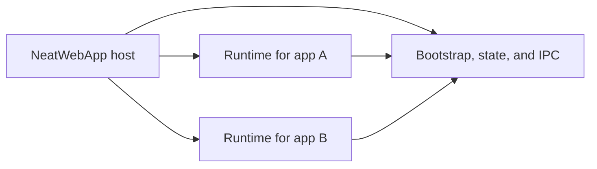

# WebApp Runtime Isolation Notes

This file is kept as a short historical record of why NeatWebApp moved from a single-process browser window model to a host/runtime split.

## Why The Split Happened

The original prototype owned every browser window and floating icon inside the main `NeatWebApp` process. That design caused window-ordering bugs that were difficult to eliminate cleanly:

- collapsing one web app window could change which sibling window became key or main
- restoring one window could bring unrelated windows forward
- app activation remained application-wide instead of window-specific

The problem was architectural, not just an animation or timing bug. As long as every window lived under the same `NSApplication`, AppKit still treated them as one app-level window group.

## Current Result

The repository now uses a split runtime model:

- `NeatWebApp` stays focused on launcher UI, dashboard UI, catalog state, favicon caching, and runtime orchestration
- `NeatWebAppRuntime` hosts a single browser window runtime and its floating icon lifecycle
- shared bootstrap/state models and IPC helpers live in `Sources/Shared`

That boundary is what makes per-web-app window isolation workable.

## Implementation Shape

The host launches a runtime by writing bootstrap data, starting `NeatWebAppRuntime`, and then observing published runtime state. Each runtime owns its own browser session, window controller, and floating icon behavior.

## What This Document No Longer Tries To Be

The previous version of this file had grown into a long implementation plan, migration guide, and code-reading notebook. That was useful during the refactor, but it is no longer the right shape for a public repository because it:

- mixed historical and current-state information
- referenced local absolute filesystem paths
- described already-completed migration steps as if they were still pending

The source of truth for the current structure is now:

- `project.yml`
- `docs/architecture.md`
- the code under `Sources/NeatWebApp`, `Sources/NeatWebAppRuntime`, and `Sources/Shared`
