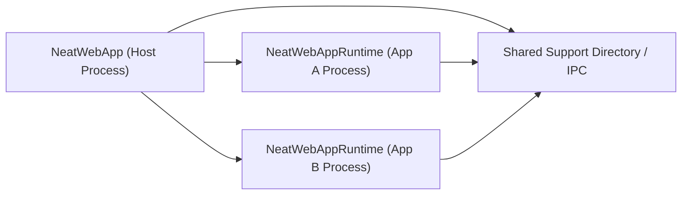

# WebApp Runtime Isolation Refactor

## 0. 当前状态

这份文档最初是“按方案实施”的重构说明；当前仓库已经完成了主体落地，下面保留这些设计内容，主要用于解释为什么要按现在的方式拆分。

截至当前代码状态：

- `NeatWebApp` 已经退回 Host 角色，只负责 launcher、dashboard、网站定义、favicon 缓存和 runtime 调度。
- `NeatWebAppRuntime` 已作为嵌入式 helper app 承载单个 WebApp 的 `WKWebView`、内容窗口和悬浮图标。
- Host / Runtime 通过 `RuntimeBootstrap`、`RuntimeState`、`RuntimeCommandBus` 和 `RuntimeAppLock` 协作。
- 悬浮图标的显示、拖拽、吸附和展开动画已经运行在 runtime 内，不再由 Host 进程直接参与窗口层切换。
- Host 会在刷新 runtime 注册表时识别旧 helper 构建，并在必要时终止旧 runtime 后按原状态重启。

当前落地代码入口：

- Host 协调器：[WebAppRuntimeCoordinator.swift](/Users/geraltgraham/Codes/Swift/NeatWebApp/Sources/NeatWebApp/Services/WebAppRuntimeCoordinator.swift)
- Helper 入口：[NeatWebAppRuntimeApp.swift](/Users/geraltgraham/Codes/Swift/NeatWebApp/Sources/NeatWebAppRuntime/App/NeatWebAppRuntimeApp.swift)
- Runtime 窗口协调：[RuntimeWindowCoordinator.swift](/Users/geraltgraham/Codes/Swift/NeatWebApp/Sources/NeatWebAppRuntime/Services/RuntimeWindowCoordinator.swift)
- 窗口 / 悬浮图标行为：[WebAppWindowController.swift](/Users/geraltgraham/Codes/Swift/NeatWebApp/Sources/NeatWebApp/Services/WebAppWindowController.swift)
- Shared 运行时模型：[RuntimeModels.swift](/Users/geraltgraham/Codes/Swift/NeatWebApp/Sources/Shared/Runtime/RuntimeModels.swift)

## 1. 文档目的

本文件定义 `NeatWebApp` 的窗口隔离重构方案，目标是从架构层面彻底解决以下问题，而不是继续在现有单进程窗口模型上打补丁：

1. 收起网页窗口 A 到悬浮图标时，网页窗口 B 被错误带到前台或后台。
2. 从悬浮图标展开窗口 A 时，窗口一度前置后又瞬间退回后台。
3. A 的收起/展开会影响 B 的 z-order、key/main、前后台状态。

这份方案面向“由别人按文档实施”，因此会明确：

- 当前根因
- 目标架构
- 进程边界
- IPC 设计
- 工程拆分
- 迁移步骤
- 验收标准

## 2. 结论先行

### 2.1 根因不是动画或 panel 细节，而是进程模型错误

当前仓库里，所有网页窗口和悬浮图标都运行在同一个 `NeatWebApp` 进程、同一个 `NSApplication` 之下：

- 入口在 [NeatWebAppApp.swift](/Users/geraltgraham/Codes/Swift/NeatWebApp/Sources/NeatWebApp/App/NeatWebAppApp.swift)
- 顶层状态在 [AppModel.swift](/Users/geraltgraham/Codes/Swift/NeatWebApp/Sources/NeatWebApp/Services/AppModel.swift)
- 网页窗口复用协调在 [WebAppWindowCoordinator.swift](/Users/geraltgraham/Codes/Swift/NeatWebApp/Sources/NeatWebApp/Services/WebAppWindowCoordinator.swift)
- 单个网页窗口、悬浮图标、收起/展开动画都在 [WebAppWindowController.swift](/Users/geraltgraham/Codes/Swift/NeatWebApp/Sources/NeatWebApp/Services/WebAppWindowController.swift)
- 悬浮图标 panel / view 支持代码在 [WebAppFloatingIconSupport.swift](/Users/geraltgraham/Codes/Swift/NeatWebApp/Sources/NeatWebApp/Services/WebAppFloatingIconSupport.swift)

这意味着在 macOS 看来，A 和 B 不是两个互不相关的窗口宿主，而是“同一个 accessory app 的两个窗口”。

只要还维持这个前提，以下现象就无法彻底消失：

- A 收起时，AppKit 会重新选择同 app 内剩余的 `main/key` 候选窗口。
- A 展开时，app 激活是“应用级”的，不是“单窗口级”的。
- `NSPanel` 的 `nonactivatingPanel` 只能保证 panel 自己不激活 app，不能让同一 `NSApplication` 下的 A、B 彻底互不影响。

### 2.2 正确的解法

必须把“网页窗口运行时”从主 app 进程中拆出去。

推荐的最终架构：

- `NeatWebApp` 主进程只负责 launcher、dashboard、配置、应用定义管理。
- 每个网页 app 由独立的 `NeatWebAppRuntime` 进程承载。
- 每个 runtime 进程只负责一个 `WebAppDefinition.id` 的单窗口生命周期和对应悬浮图标。
- 主进程与 runtime 进程通过明确的 IPC 协议通信。

这样以后：

- A 收起/展开不会让 B 参与同进程窗口竞争。
- A 的激活/失焦只影响 A 对应的 runtime 进程。
- “窗口隔离”成为进程边界保证，而不是事件时序侥幸成立。

## 3. 官方行为依据

下面这些平台行为决定了“同进程补丁式修复”不是长期方案：

1. `NSRunningApplication.activateWithOptions` 是应用级激活，不是单窗口级激活。
2. `NSApplicationActivationOptions.activateAllWindows` 的语义本身就是“bring the application’s windows forward”。
3. `NSRunningApplication.activate...` 官方说明里明确说过，不应假设应用会立即激活，甚至不保证一定激活。
4. `NSWorkspace.OpenConfiguration.createsNewApplicationInstance` 支持忽略已运行实例并启动同一 app 的新实例，这正好可用于多 runtime 进程模型。
5. 当前主 app `Info.plist` 已经是 `LSUIElement=true`，也就是 accessory app 模式：[Info.plist](/Users/geraltgraham/Codes/Swift/NeatWebApp/Sources/NeatWebApp/App/Info.plist)

可参考的 Apple 文档入口：

- [NSRunningApplication](https://developer.apple.com/documentation/appkit/nsrunningapplication)
- [NSWorkspace.OpenConfiguration](https://developer.apple.com/documentation/appkit/nsworkspace/openconfiguration)
- [NSApplicationActivationPolicy.accessory](https://developer.apple.com/documentation/appkit/nsapplicationactivationpolicy/accessory)

## 4. 当前架构盘点

### 4.1 重构前的进程内职责分布

这一节保留的是重构前盘点，用来解释为什么必须拆 runtime。

当时的 `NeatWebApp` 是单 target、单进程：

- 工程定义见 [project.yml](/Users/geraltgraham/Codes/Swift/NeatWebApp/project.yml)
- 只有 `NeatWebApp` 和 `NeatWebAppTests` 两个 target

当时职责：

- 主 app：
  - menu bar extra
  - dashboard
  - launcher overlay
  - 自定义 app 列表
  - favicon 缓存
  - launch at login
- 同一主 app 内还承载：
  - `WKWebView`
  - 网页窗口
  - 收起成悬浮图标
  - 展开动画
  - 外部 app 激活/回退逻辑

### 4.2 重构前关键文件与问题对应关系

#### Host 层

- [NeatWebAppApp.swift](/Users/geraltgraham/Codes/Swift/NeatWebApp/Sources/NeatWebApp/App/NeatWebAppApp.swift)
  - app 入口
  - `MenuBarExtra`
  - dashboard scene

- [AppModel.swift](/Users/geraltgraham/Codes/Swift/NeatWebApp/Sources/NeatWebApp/Services/AppModel.swift)
  - launcher 和 app 列表状态
  - `openWebApp(_:)` 最终触发 `windowCoordinator.open(...)`

- [WebAppRuntimeCoordinator.swift](/Users/geraltgraham/Codes/Swift/NeatWebApp/Sources/NeatWebApp/Services/WebAppRuntimeCoordinator.swift)
  - 当前 Host 侧 runtime 调度中心，负责按 `appID` 管理 registry、发命令和接管旧 helper

#### 运行时层，当时错误地仍在 Host 进程中

- [WebAppWindowCoordinator.swift](/Users/geraltgraham/Codes/Swift/NeatWebApp/Sources/NeatWebApp/Services/WebAppWindowCoordinator.swift)
  - 当时以 `app.id -> WebAppWindowController` 的方式单进程复用网页窗口

- [WebAppWindowController.swift](/Users/geraltgraham/Codes/Swift/NeatWebApp/Sources/NeatWebApp/Services/WebAppWindowController.swift)
  - 创建 `NSWindow`
  - 处理 collapse / expand
  - 管理 `NSRunningApplication` 激活切换
  - 管理悬浮图标 panel 和过渡快照 panel

- [BrowserSession.swift](/Users/geraltgraham/Codes/Swift/NeatWebApp/Sources/NeatWebApp/Features/Browser/BrowserSession.swift)
  - `WKWebView` 状态
  - page zoom / UA / pinned
  - 持久化 preference

- [WebAppFloatingIconSupport.swift](/Users/geraltgraham/Codes/Swift/NeatWebApp/Sources/NeatWebApp/Services/WebAppFloatingIconSupport.swift)
  - 悬浮图标 panel
  - 快照过渡 panel
  - snap resolver

### 4.3 当前单进程模型的必然缺陷

在现有模型下：

1. A 收起时，A 所属 `NSWindow` 从当前 app 里移除可见窗口集合。
2. AppKit 会在同 app 剩余窗口中重新决定 `main/key`。
3. 如果 B 仍属于当前 app，它就天然会参与这个竞争。
4. A 展开时，激活的是整个 `NeatWebApp`，不是只激活 A。

所以“修复 A，但 B 完全不受影响”在同进程内不具可证明性。

## 5. 目标架构

### 5.1 总体结构



### 5.2 进程职责划分

#### Host 进程：`NeatWebApp`

保留：

- dashboard
- launcher overlay
- menu bar extra
- `WebAppDefinition` 列表管理
- favicon 缓存
- launch at login
- runtime 启动、查找、回收

删除：

- `WKWebView`
- 网页窗口创建
- 悬浮图标宿主
- 网页窗口收起/展开动画

#### Runtime 进程：`NeatWebAppRuntime`

负责：

- 单个 `WebAppDefinition.id` 的 `WKWebView`
- 单个 `NSWindow`
- 单个悬浮图标 panel
- 页面导航 / zoom / pinned / UA
- 窗口 frame 和图标 frame 持久化
- 收起/展开动画
- 失焦后把焦点还给外部 app

不负责：

- dashboard
- launcher
- app 定义增删改排序
- 全局偏好入口

### 5.3 一句话原则

任何拥有浏览器窗口或悬浮图标的对象，都不应该再运行在 `NeatWebApp` host 进程里。

## 6. Target 与工程拆分方案

### 6.1 当前已落地的 target

当前 [project.yml](/Users/geraltgraham/Codes/Swift/NeatWebApp/project.yml) 已落地以下 target：

1. `NeatWebApp`
   - Host app
2. `NeatWebAppRuntime`
   - `LSUIElement = true` 的 helper app，用于承载单个网页窗口 runtime
3. `NeatWebAppTests`
   - Host 测试 bundle
4. `NeatWebAppRuntimeTests`
   - Runtime 测试 bundle

Shared 代码当前采用 `Sources/Shared` 目录，并通过 source inclusion 同时编入 Host 和 Runtime，而不是单独拆成 framework target。

### 6.2 当前 target 结构

```text
Targets
- NeatWebApp              # Host
- NeatWebAppRuntime       # Runtime helper app
- NeatWebAppTests         # Host-focused tests
- NeatWebAppRuntimeTests  # Runtime-focused tests
```

### 6.3 当前源码目录结构

```text
Sources/
  NeatWebApp/
    App/
    Models/
    Services/
    Features/Launcher/
    Features/Dashboard/

  NeatWebAppRuntime/
    App/
    Services/

  Shared/
    Runtime/
    Utilities/
```

### 6.4 当前落地后的文件归属

#### 保留在 Host

- [NeatWebAppApp.swift](/Users/geraltgraham/Codes/Swift/NeatWebApp/Sources/NeatWebApp/App/NeatWebAppApp.swift)
- [AppModel.swift](/Users/geraltgraham/Codes/Swift/NeatWebApp/Sources/NeatWebApp/Services/AppModel.swift)
- [WebAppRuntimeCoordinator.swift](/Users/geraltgraham/Codes/Swift/NeatWebApp/Sources/NeatWebApp/Services/WebAppRuntimeCoordinator.swift)
- launcher 相关文件
- dashboard 相关文件
- 自定义 app 存储、favicon 缓存、launch at login

#### 共享给 Host / Runtime

- `WebAppDefinition`
- 偏好模型与持久化协议
- 运行时 bootstrap/state 模型
- IPC message 模型
- runtime 锁与 registry 存储

#### Runtime 持有或编入 Runtime target

- [WebAppWindowController.swift](/Users/geraltgraham/Codes/Swift/NeatWebApp/Sources/NeatWebApp/Services/WebAppWindowController.swift)
  - 由 runtime target 编译并实际承载窗口 / 悬浮图标生命周期

- [WebAppFloatingIconSupport.swift](/Users/geraltgraham/Codes/Swift/NeatWebApp/Sources/NeatWebApp/Services/WebAppFloatingIconSupport.swift)
  - 由 runtime target 编译，负责悬浮图标 panel、snap resolver 和拖拽视图

- [BrowserSession.swift](/Users/geraltgraham/Codes/Swift/NeatWebApp/Sources/NeatWebApp/Features/Browser/BrowserSession.swift)
  - 由 runtime target 持有，负责单个网页 app 的 `WKWebView` 会话

## 7. Runtime 启动模型

### 7.1 运行时粒度

一个 runtime 进程只承载一个 `WebAppDefinition.id`。

原因：

- 当前产品语义就是每个 app 单窗口复用。
- 这样才能让 A 和 B 的窗口焦点、前后台、悬浮图标完全隔离。
- 进程崩溃影响被限制在单 app 范围内。

### 7.2 Host 启动 runtime 的方式

使用 `NSWorkspace.openApplication(at:configuration:)` 的现代 API：

- `createsNewApplicationInstance = true`
- `activates = false` 或按场景设置
- `arguments = ["--instance-id", "...", "--bootstrap-path", "..."]`

`NSWorkspaceOpenConfiguration` 的 header 已明确支持：

- 忽略已运行实例并创建新实例
- 为新实例注入命令行参数和环境变量

### 7.3 为什么不能用 XPC service 代替 runtime app

不要用 XPC service 来直接承载网页窗口，原因是：

- XPC service 适合后台服务，不适合拥有用户可见的 `NSWindow`
- 这里需要的是 GUI runtime，不是后台 worker

可以有 XPC，但只能作为辅助控制面，不应该作为窗口宿主。

## 8. Host <-> Runtime 通信设计

### 8.1 设计原则

IPC 需要满足：

1. Host 能启动、查找、唤醒、终止 runtime
2. Runtime 能把状态变化回报给 host
3. 一个 runtime 崩溃不会把全局状态搞坏
4. 单条消息可以按 `instanceID` 精确路由

### 8.2 推荐实现：文件状态 + 分布式通知

建议第一版采用：

- 文件系统作为“事实状态”
- `DistributedNotificationCenter` 作为“事件触发”

原因：

- 多个 GUI app 进程之间接入成本低
- 不需要额外 launchd/mach service 配置
- 对“Host + 多 Runtime”模型足够实用

### 8.3 共享目录

统一放在：

```text
~/Library/Application Support/NeatWebApp/
```

推荐子目录：

```text
RuntimeBootstrap/
RuntimeState/
RuntimeLocks/
Preferences/
```

### 8.4 Bootstrap 文件

Host 启动 runtime 前，先生成：

```text
RuntimeBootstrap/<instanceID>.json
```

建议字段：

```json
{
  "instanceID": "UUID",
  "appID": "chatgpt",
  "definition": {
    "id": "chatgpt",
    "name": "ChatGPT",
    "homeURL": "https://chatgpt.com"
  },
  "launchReason": "openFromLauncher",
  "preferredDisplayID": 12345,
  "preferredGeometry": null,
  "createdAt": "2026-04-06T16:00:00Z",
  "hostVersion": "0.1.0"
}
```

当前实现补充：

- 当前代码中的 `RuntimeBootstrap` 已额外包含 `runtimeBuildIdentifier`、`restoredPhase`、`restoredWindowFrame`、`restoredFloatingIconFrame`，定义位于 [RuntimeModels.swift](/Users/geraltgraham/Codes/Swift/NeatWebApp/Sources/Shared/Runtime/RuntimeModels.swift)。
- `runtimeBuildIdentifier` 用于让 Host 判断某个 runtime helper 是否仍然是当前构建。
- `restored*` 字段用于旧 helper 接管时恢复窗口可见态或已收起态，而不是简单地重新打开一个“默认初始窗口”。

### 8.5 Runtime 状态文件

每个 runtime 进程维护自己的状态文件：

```text
RuntimeState/<instanceID>.json
```

建议字段：

```json
{
  "instanceID": "UUID",
  "appID": "chatgpt",
  "pid": 12345,
  "phase": "windowVisible",
  "windowFrame": "{{x,y,w,h}}",
  "floatingIconFrame": null,
  "lastUpdatedAt": "2026-04-06T16:00:03Z"
}
```

`phase` 建议枚举：

- `launching`
- `windowVisible`
- `collapsedToFloatingIcon`
- `hidden`
- `terminating`

### 8.6 锁文件

为了保证“同一个 appID 最多一个 runtime 实例”，建议加 app 级锁：

```text
RuntimeLocks/<appID>.lock
```

规则：

- Host 启动前先查 registry/state
- Runtime 启动后再次尝试获取锁
- 若发现已有活跃 runtime，第二个实例直接退出

这可以防止 launcher 连点导致同 app 多实例并存。

### 8.7 通知通道

建议使用 `DistributedNotificationCenter` 的两个固定 topic：

- `com.geraltgraham.NeatWebApp.runtime.command`
- `com.geraltgraham.NeatWebApp.runtime.event`

#### Command payload

```json
{
  "instanceID": "UUID",
  "appID": "chatgpt",
  "sequence": 42,
  "command": "expandWindow",
  "payload": {}
}
```

#### Event payload

```json
{
  "instanceID": "UUID",
  "appID": "chatgpt",
  "sequence": 42,
  "event": "collapsed",
  "payload": {
    "floatingIconFrame": "{{x,y,w,h}}"
  }
}
```

### 8.8 建议命令集

- `showWindow`
- `focusWindow`
- `collapseWindow`
- `expandWindow`
- `hideWindow`
- `reloadDefinition`
- `terminateRuntime`

### 8.9 建议事件集

- `runtimeStarted`
- `windowShown`
- `windowFocused`
- `windowCollapsed`
- `windowExpanded`
- `windowHidden`
- `runtimeTerminating`
- `runtimeCrashed`

## 9. 生命周期流程

### 9.1 从 launcher 打开网页 app

1. Host 从 launcher 点击某个 app
2. Host 查询 `RuntimeState`，确认该 `appID` 是否已有活跃 runtime
3. 若无，则创建 bootstrap 文件
4. Host 用 `NSWorkspace.OpenConfiguration` 启动 `NeatWebAppRuntime`
5. Runtime 读取 bootstrap
6. Runtime 创建 `WKWebView`、`NSWindow`
7. Runtime 写入 `RuntimeState`
8. Runtime 发 `runtimeStarted` / `windowShown`

### 9.2 收起窗口到悬浮图标

1. 用户在 runtime 窗口里触发 collapse
2. Runtime 自己完成窗口截图、动画、隐藏主窗口、显示 floating icon
3. Runtime 更新 `RuntimeState.phase = collapsedToFloatingIcon`
4. Runtime 激活“之前的外部 app”

注意：

- 这一步完全不经过 Host 的窗口层
- 因为 B 是另一个 runtime 进程，所以不会被 A 拉进前后台切换

当前实现补充：

- 悬浮图标 panel、拖拽手势和吸附逻辑都运行在 runtime 内部的窗口控制器链路中。
- 图标素材优先从 `WebAppFaviconStore` 读取站点 favicon；如果当前站点还没有缓存，则回退到首字母默认图标。
- Runtime 默认会复用 Host 的 favicon 缓存目录，因此 launcher 图标和悬浮图标读取的是同一份缓存，不需要额外让 Host 通过 IPC 传图。

### 9.3 从悬浮图标展开

1. 用户点击 A 的 floating icon
2. A 对应 runtime 自己展开自己的窗口
3. A 对应 runtime 激活自己进程并前置自己的窗口
4. `RuntimeState.phase = windowVisible`

注意：

- 依旧完全不碰 B

当前实现补充：

- 旧 helper 被替换时，bootstrap 会携带 `restoredPhase`、`restoredWindowFrame` 和 `restoredFloatingIconFrame`。
- 如果旧 runtime 在退出前处于 `collapsedToFloatingIcon`，新 runtime 会直接恢复为已收起态，并沿用原有悬浮图标位置。
- 如果旧 runtime 处于 `windowVisible`，新 runtime 会恢复可见窗口；`hidden` 和 `terminating` 状态不会被主动重新拉起。

### 9.4 从 launcher 重新打开一个已收起的 app

1. Host 发现 `appID` 已有 runtime 且 `phase = collapsedToFloatingIcon`
2. Host 不再新建 runtime
3. Host 向对应 `instanceID` 发送 `expandWindow`
4. Runtime 自己展开

当前实现补充：

- Host 刷新注册表时还会额外比较 bootstrap 中的 `runtimeBuildIdentifier` 与当前 helper 构建标识。
- 如果发现“主 App 已升级，但某个已打开网页 app 仍停留在旧 helper”，Host 会先发送 `terminateRuntime`，等待旧进程退出，再带着恢复态 bootstrap 启动新的 helper。
- 这让之前已经打开的网页 app 在升级后也能切换到新的悬浮图标和窗口行为实现，而不要求用户手动关闭重开。

### 9.5 Host 重启 / Runtime 已在运行

1. Host 启动时扫描 `RuntimeState/`
2. 用 `pid` + `NSRunningApplication.runningApplication(withProcessIdentifier:)` 验证进程是否还活着
3. 对死进程清理 stale state
4. 对活进程重建内存中的 runtime registry

当前实现补充：

- 现有 Host 入口会在 `WebAppRuntimeCoordinator.refreshRegistry()` 中完成这轮扫描和清理。
- 刷新阶段除了重建 registry，还会顺带执行旧 helper 自动接管逻辑，因此“Host 重启后仍有旧 runtime 残留”的场景也会被统一处理。

## 10. Host 侧需要新增的核心对象

### 10.1 `WebAppRuntimeCoordinator`

替换当前的 `WebAppWindowCoordinator`。

职责：

- 按 `appID` 管理 runtime registry
- 启动 runtime
- 查找已有 runtime
- 发送 command
- 清理 stale state

建议接口：

```swift
@MainActor
protocol WebAppRuntimeCoordinating {
    func open(_ definition: WebAppDefinition, preferredGeometry: ScreenNotchGeometry?)
    func focus(appID: String)
    func collapse(appID: String)
    func expand(appID: String)
    func terminate(appID: String)
    func refreshRegistry()
}
```

### 10.2 `RuntimeRegistryStore`

职责：

- 读取/写入 `RuntimeState`
- 查询 `appID -> instanceID/pid/phase`
- 清理 stale runtime

### 10.3 `RuntimeLauncher`

职责：

- 生成 bootstrap 文件
- 找到 embedded runtime app URL
- 调用 `NSWorkspace.openApplicationAtURL(...configuration...)`

### 10.4 `RuntimeCommandBus`

职责：

- 向 runtime 发 distributed notification
- 监听 runtime event

## 11. Runtime 侧需要新增的核心对象

### 11.1 `RuntimeAppModel`

替代 Host 的 `AppModel` 子集，职责只聚焦单个网页 app。

包括：

- `definition`
- `windowVisibility`
- `isCollapsed`
- `windowFrame`
- `floatingIconFrame`

### 11.2 `RuntimeBootstrapLoader`

职责：

- 读取启动参数
- 加载 bootstrap JSON
- 校验 `appID`、`instanceID`

### 11.3 `RuntimeEventPublisher`

职责：

- 更新 `RuntimeState`
- 发 `runtime event`

### 11.4 `RuntimeCommandListener`

职责：

- 监听 Host 发来的 `expandWindow` / `focusWindow` / `terminateRuntime`

### 11.5 `RuntimeWindowCoordinator`

职责：

- 拥有 `BrowserSession`
- 拥有 `WebAppWindowController`
- 拥有悬浮图标展开/收起协调

## 12. 现有文件的重构建议

### 12.1 `BrowserSession`

当前 [BrowserSession.swift](/Users/geraltgraham/Codes/Swift/NeatWebApp/Sources/NeatWebApp/Features/Browser/BrowserSession.swift) 既处理浏览器状态，又直接依赖 window callback。

重构建议：

- 保留网页会话能力
- 去掉对 Host 级协作对象的假设
- 把 `onCloseRequest` / `onCollapseRequest` 变成 runtime 内部命令

### 12.2 `WebAppWindowController`

当前 [WebAppWindowController.swift](/Users/geraltgraham/Codes/Swift/NeatWebApp/Sources/NeatWebApp/Services/WebAppWindowController.swift) 既是窗口控制器，又承担：

- 动画状态机
- 浮标管理
- 焦点切换策略
- 屏幕定位

重构建议：

- 保留“单 runtime 内窗口控制”职责
- 不再出现在 Host target 中
- 把 Host 相关回调彻底删掉

### 12.3 `AppModel`

当前 [AppModel.swift](/Users/geraltgraham/Codes/Swift/NeatWebApp/Sources/NeatWebApp/Services/AppModel.swift) 里 `openWebApp(_:)` 仍直接进入窗口协调器。

重构后：

- `AppModel` 只调 `WebAppRuntimeCoordinator`
- 不再持有任何网页窗口 controller / browser session

## 13. 迁移计划

## Phase 0：建立共享基础设施

目标：

- 不改变当前 UI
- 先把共享模型和 runtime registry 建起来

任务：

1. 新建 `RuntimeBootstrap`
2. 新建 `RuntimeState`
3. 新建 `RuntimeRegistryStore`
4. 新建 `RuntimeCommand` / `RuntimeEvent`

验收：

- Host 能读写 bootstrap/state 文件

## Phase 1：引入 `NeatWebAppRuntime` target

目标：

- 能手动拉起 runtime app

任务：

1. 在 `project.yml` 新增 runtime target
2. 新建 runtime `Info.plist`
3. runtime app 启动后显示一个空测试窗口
4. Host 能通过 `NSWorkspace.OpenConfiguration` 启动它

验收：

- 能同时启动多个 runtime 实例
- 使用 `createsNewApplicationInstance = true`

## Phase 2：把浏览器窗口迁到 runtime

目标：

- runtime 真正承载 `WKWebView`

任务：

1. 迁移 `BrowserSession`
2. 迁移 `WebAppWindowController`
3. 迁移 `WebAppFloatingIconSupport`
4. runtime 读取 bootstrap 后打开指定网页 app

验收：

- Host 进程里不再创建网页窗口

## Phase 3：接入 collapse / expand / floating icon

目标：

- 收起/展开全部发生在 runtime 内

任务：

1. runtime 内实现 collapse / expand
2. runtime 写 `RuntimeState.phase`
3. Host 对已运行 runtime 改为“发命令”而不是“操作窗口对象”

验收：

- A collapse / expand 时，B 不改变前后台

## Phase 4：替换 Host 协调层

目标：

- Host 不再依赖 `WebAppWindowCoordinator`

任务：

1. 新建 `WebAppRuntimeCoordinator`
2. 修改 [AppModel.swift](/Users/geraltgraham/Codes/Swift/NeatWebApp/Sources/NeatWebApp/Services/AppModel.swift) 中的 `openWebApp(_:)`
3. 删除 Host target 对 browser/window controller 的依赖

验收：

- Host 可仅靠 runtime registry 管理网页 app

## Phase 5：删除旧单进程路径

目标：

- 彻底切断回退路径

任务：

1. 删除 Host target 中的旧 `WebAppWindowCoordinator`
2. 删除 Host 对 `WebAppWindowController` 的编译依赖
3. 删除所有“Host 直接激活网页窗口”的代码

验收：

- Host target 编译时完全不包含网页窗口代码

## 14. 验收标准

以下用例全部通过，才算这次重构完成：

### 14.1 核心隔离用例

1. 打开 A、B 两个网页 app
2. 让 B 被其他应用窗口覆盖
3. 收起 A
4. 期望：B 不上前，不下沉，不闪动

1. A 已收起为浮标
2. B 在后台或前台任意状态
3. 展开 A
4. 期望：只有 A 前置；B 不闪动、不下沉

1. 收起 A
2. B 保持可见
3. 期望：B 不会跟着一起退到后台

### 14.2 崩溃恢复用例

1. 强杀 runtime A
2. Host 重新打开 A
3. 期望：只重启 A；B 不受影响

### 14.3 多显示器用例

1. A 在显示器 1
2. B 在显示器 2
3. 分别收起/展开
4. 期望：各自只影响各自所在 runtime

### 14.4 持久化用例

1. 修改 A zoom / pinned / UA
2. 退出 runtime A
3. 重开 A
4. 期望：设置恢复

## 15. 自动化测试建议

当前仅有单元测试远远不够，需要新增两类测试。

### 15.1 Shared 单元测试

- bootstrap 编码解码
- runtime state 编码解码
- registry 清理 stale pid
- command/event 路由

### 15.2 集成 / UI 测试

需要覆盖：

- 启动两个 runtime
- collapse A 不影响 B
- expand A 不影响 B
- runtime 崩溃恢复

建议实现方式：

- `XCUI` 做主流程
- 必要时用 `CGWindowListCopyWindowInfo` 校验窗口层级
- debug 构建中暴露测试 hook，便于稳定等待状态

## 16. 风险与规避

### 风险 1：重复实例

问题：

- Launcher 连点可能拉起多个同 app runtime

规避：

- Host registry 去重
- Runtime lock file 二次兜底

### 风险 2：多进程写同一份偏好

问题：

- Host 和 runtime 同时写 JSON 容易互相覆盖

规避：

- Host 只写 app 定义类数据
- Runtime 只写运行期窗口/浏览器偏好
- 高频状态使用每实例单文件

### 风险 3：IPC 丢消息

问题：

- 分布式通知不应被当成唯一事实来源

规避：

- 通知只做触发
- 文件状态才是事实来源
- Host 收到超时后重新读 state

### 风险 4：运行时 target 过早引入太多共享依赖

问题：

- 如果 host/runtime/shared 边界不清，会重新耦合回去

规避：

- 先定义 target 边界，再迁代码
- Host 不可 import Runtime

## 17. 不要再做的事

下面这些方向不应继续投入：

1. 在 Host 进程里继续补 `NSRunningApplication.activate(...)` 的时序
2. 试图通过 `nonactivatingPanel` 让同进程窗口彻底隔离
3. 继续把 A、B 当作“逻辑上独立、物理上同进程”去优化
4. 再往 [WebAppWindowController.swift](/Users/geraltgraham/Codes/Swift/NeatWebApp/Sources/NeatWebApp/Services/WebAppWindowController.swift) 里叠新的焦点补丁

## 18. 实施完成后的代码形态

完成后应达到：

- Host target 不编译任何网页窗口或悬浮图标代码
- Runtime target 独立拥有浏览器窗口和浮标
- `AppModel.openWebApp(_:)` 只做 runtime 调度
- 同一个网页 app 的所有窗口行为都在同一个 runtime 进程内闭环
- 不同网页 app 之间通过“进程隔离”而不是“事件协调”保证互不影响

## 19. 最终判断

这次问题不是单个 bug，而是“窗口宿主架构放错了层”。

如果目标是：

- A 与 B 真正互不联动
- 收起/展开行为稳定
- 后续不再反复引入焦点竞态

那就必须执行本文件的 runtime isolation 重构，而不是继续在现有单进程 `WebAppWindowController` 上修补。
